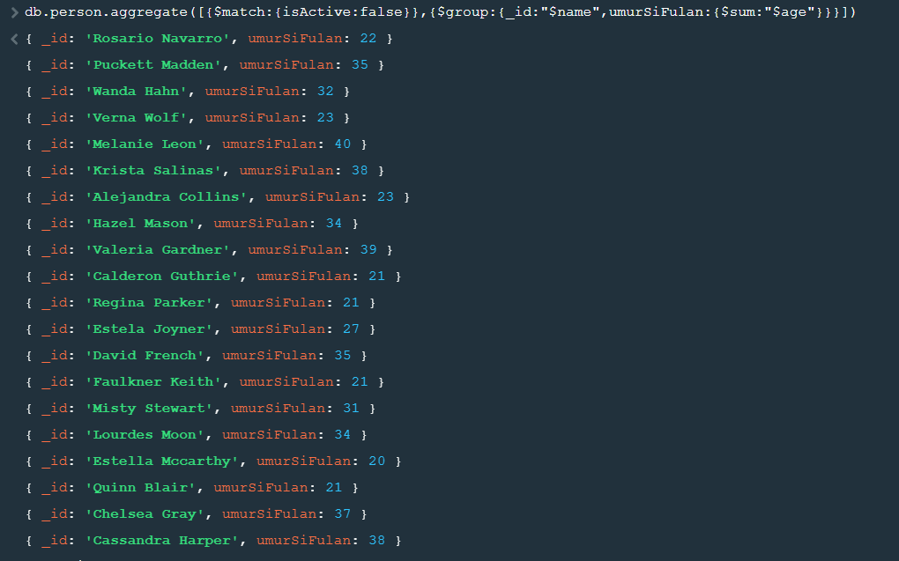

<h1>Project Golang Web e-commerce </h1>

<h3>tech stack</h3>
<ul>
    <li>Golang</li>
    <li>mongodb</li>
    <li></li>
</ul>

<h3>Penjelasan</h3>
<ol>
    <li>
        <h4><b>Aggregate</b></h4>
        
operasi di mongodb misal where select avg sum di sql

        
misalkan disini ada database bernama <b>belajar-mongodb-copass</b> dan ada collection/table person

        
        

        <ul>
            <li>
                <h4>match</h4>
            </li>
            
kalo match itu adalah mereturnkan semua document/row yang cocok

            
dalam studi kasus ini adalah yang isActive nya false

            
            
            <li>
                <h4>group</h4>
            </li>
            
kalo misalnya tadi sudah <i>di-match</i> maka group akan mengembalikan dokumen yang serupa seperti match
                hanya saja fieldnya sudah ditentukan

            
dalam studi kasus ini adalah yang isActive di-match-kan lalu di-group berdasarkan name

            
untuk sintaks dari group yaitu field yang ingin diambil maka akan menjadi key <i>_id</i>

            
            <li>
                <h4>unwind</h4>
            </li>
            
membuat dokumen/row baru dari setiap dokumen/row yang mempunyai nested value

            
studi kasus ini setiap dokumen punya field tags nah lalu nanti setiap tags akan dibuatkan dokumen/row
                masing-masing

            
        </ul>
    </li>
</ol>